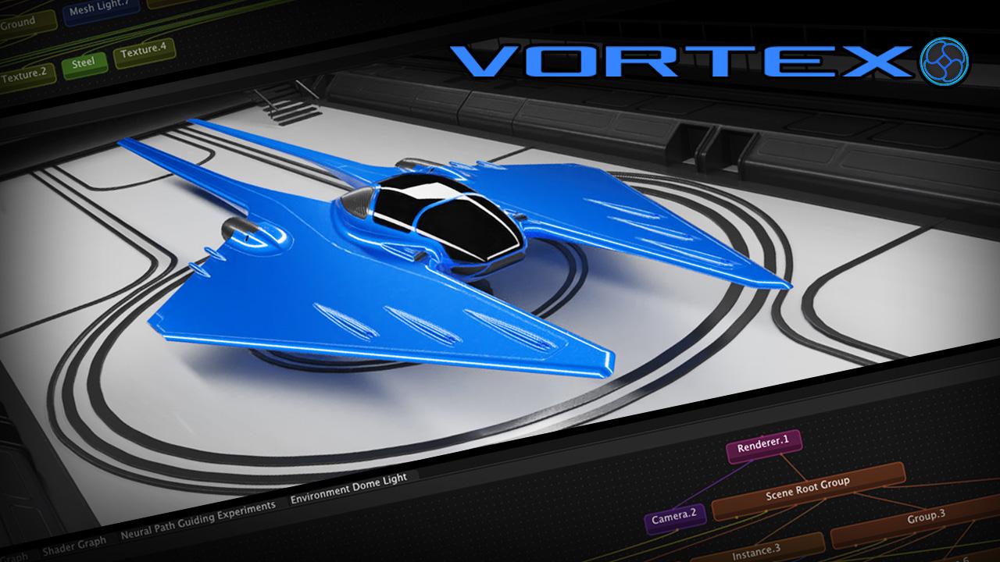
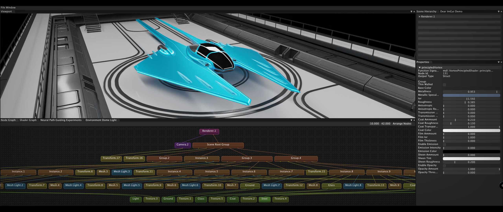

# Vortex 

### [Demo Video: Check out Vortex in Action](https://www.youtube.com/watch?v=fQn29vja1NI)
[Hello there](https://media.giphy.com/media/xTiIzJSKB4l7xTouE8/giphy.gif)!
I'm [Lorenzo Mauro](https://www.linkedin.com/in/lorenzo-mauro-4082a088/), currently diving deep into the finishing stages of a Computer Graphics/Computer Science PhD at the [University of Rome](https://phd.uniroma1.it/web/LORENZO-MAURO_nP1529128_EN.aspx). In the past, I've also dipped my toes in concept art at [OnePixelBrush](https://onepixelbrush.com/). If you want to take a walk down memory lane, here's my [portfolio](https://www.artstation.com/lomar).

Vortex is a labor of love, built from the ground up with two primary objectives in mind:

1. **Practical Skill Development**: As someone passionate about computer graphics, I wanted to do more than work within the confines of existing frameworks to achieve my PhD thesis. Diving deep into the nitty-gritty of renderer development provided invaluable insights and hands-on experience beyond the regular PhD curriculum.

2. **Research Endeavor**: Vortex is a playground for my academic research. With it, I have been able to intertwine Path Guiding techniques with the power of neural networks.

While Vortex is a comprehensive project, it's essential to note that its current version reflects focused objectives under tight timelines. I've been the solo developer, so prioritization has been crucial. A few features like volumetrics are on my radar for future iterations, but at present, the emphasis remains on optimizing and refining the neural network components due to the demands of my PhD work, which is a beast on its own.

If you have feedback, find bugs, or are intrigued by any part of this project, please feel free to reach out 😄.

Happy rendering!


## Table of Contents

- [Introduction](#vortex)
- [Demo Video](#demo-video)
- [Installer](#installer)
- [Technical Details](#technical-details)
  - [Tech Stack & Dependencies](#tech-stack--dependencies)
  - [Architecture](#architecture)
  - [Features & Capabilities](#features--capabilities)
  - [Neural Network Path Guiding](#neural-network-path-guiding)
  - [Future Roadmap](#future-roadmap)
  - [Collaboration](#collaboration)
- [Installation Guide](#installation-guide)
  - [Cloning the Repository](#cloning-the-repository)
  - [Pre-requisites](#pre-requisites)
  - [Scripted Setup](#scripted-setup)
  - [Manual Installation](#manual-installation)
    - [Vcpkg Setup](#vcpkg-setup)
    - [Building MDL](#building-mdl)
    - [Configuring Vortex](#configuring-vortex)

## Demo Video
If you want to see Vortex in action, I've shot a small demo video, which you can find here on [youtube](https://www.youtube.com/watch?v=fQn29vja1NI)!

## Installer
If, instead, you want to give Vortex a try, I've set up an installer ready for you to download in the [Alpha Release](https://github.com/LorenzoMauro/Vortex/releases/download/v0.1.0-alpha/VortexInstaller.exe).

- **Usage**:
  - **Navigation**:
    - **Orbit** : `middle mouse button`
    - **Pan** : `shift + middle mouse button`
    - **Zoom** : `middle mouse scroll` or `ctr + middle mouse scroll`
    - **Focal Length** : `alt + middle mouse scroll`
  - **Transform Actions**:
    Similarly to Blender, you can transform instances with mouse shortcuts. Just select an instance by mouse picking in the viewport or select a group by selecting the relative nodes in the node graph window or hierarchy panel, then press:
    - **Rotation** : `R`
    - **Scaling** : `S`
    - **Translate** : `T`

    While performing a transformation, you can change the axis by pressing `x`, `y` or `z`, then `enter` to confirm or `esc` to go back.
  - **Saving/Loading** :  you can import models in the `*.obj`,`*.fbx` or `*.gltf` format. The most supported format for materials is the `*.gltf` format with separate textures (not embedded in the file). You can also save the scene to a `*.xml` or the custom binary extension `*vtx`, which you can load afterward.

Finally, just a couple of things to know:
- The installer comes with a demo scene you can load. Click on the File button in the main menu bar and then "Open Demo".
- I've mainly tested this on a machine with an NVIDIA RTX 3090 and 24GB of RAM. Some features, like the wavefront architecture and neural networks, can be pretty memory-hungry. In this regard, I also ran the demo scene on a GTX 1060 Ti with just 4GB.

Keep in mind, I'm still in the trenches with my PhD work, so some optimizations and features are on hold. But feel free to download it and let me know how it works on your setup.


## Technical Details

### Tech Stack & Dependencies
Vortex is a GPU physically-based renderer. It leverages [Nvidia OptiX](https://developer.nvidia.com/rtx/ray-tracing/optix) for ray-tracing acceleration and the [Nvidia MDL-SDK](https://developer.nvidia.com/nvidia-mdl-sdk-get-started) for material shaders. With an [ImGui](https://github.com/ocornut/imgui)-based GUI it is possible to navigate the scene and customize most of the renderer settings. Vortex also supports the import of 3D scenes in standard formats with [Assimp](https://github.com/assimp/assimp), even though the gltf format with separate textures has been proven to be the most compatible way of loading scenes. Scene customization and editing options are currently limited, but a shader graph node is available, allowing for material parameter edits.

### Architecture
The core of Vortex's design utilizes a node graph to describe most components in conjunction with the visitor pattern to perform various operations.

The Renderer has two modes: 
1. A mode reliant entirely on Optix shader binding tables and functions for the architectural framework.
2. A wavefront architecture mode that combines Optix functions for ray tracing with CUDA kernels for shading tasks and SOA data structures to minimize divergence. 

The wavefront architecture has been crucial in allowing the use of neural networks for path guiding while performing training and inference during rendering. Currently, the network is developed with [LibTorch](https://pytorch.org/cppdocs/). An eventual transition to [tiny-cuda](https://github.com/NVlabs/tiny-cuda-nn) is on the horizon, though immediate constraints make libTorch a more practical choice.

### Features & Capabilities
Vortex supports instancing and, thanks to the integration of the mdl-sdk, is compatible with a broad range of materials. An in-house "uber-shader" has also been developed, drawing inspiration from the Disney principled shader and Blender's equivalent. Furthermore, Vortex also implements adaptive sampling, firefly removal, tone mapping, and denoising with the Optix Denoiser.

### Neural Network Path Guiding
The highlight of Vortex is its use of neural networks for path guiding. In the wavefront architecture, bounce information is retained. During training, a neural network is fine-tuned to generate a distribution from which ray extension samples are derived. This training minimizes the KL divergence between the sample's distribution value and the light transport equation's returned value. This lets Vortex produce samples that simultaneously consider light distribution and material properties, greatly speeding up variance reduction in challenging scenes.

### Future Roadmap
The immediate focus lies on optimizing the neural network. Improvements over existing methodologies have been identified, particularly in better sample selection for training. A primary identified challenge is ensuring the neural network has sufficient exposure during training to challenging sample paths, like caustics, which current papers don't adequately address. In terms of capabilities, future iterations of Vortex aim at improving the general performance, both in terms of speed and memory usage, which at the current stage has yet to receive the proper attention it needs. Furthermore, the aim is to support dynamic scenes, volumetric rendering, and eventually, geometry and material editing functionalities.

### Collaboration
Vortex has been my solo passion project so far, but if any brave soul out there feels a pull towards it and thinks, "Hey, I could help make this even cooler," hit me up! I'd be thrilled to join forces and take Vortex to the next level together.

## Installation Guide
**Note on Compatibility**:
This project has been developed for **Windows** and has been primarily tested with **Visual Studio 2022**.
While I've tried my best to make the installation process as smooth as possible, it's been validated on only a few machines. If you come across any bugs or issues, please don't hesitate to let me know. I'd genuinely appreciate the feedback and any information about potential hitches you might encounter.
### Cloning the Repository

If you haven't already cloned the repository, make sure you do so recursively to ensure all submodules are initialized and updated:

```bash
git clone --recursive https://github.com/LorenzoMauro/Vortex.git
```

If you've already cloned the repo but forgot the `--recursive` flag, you can initialize and update the submodules with:

```bash
cd [Vortex-Repo]
git submodule update --init --recursive
```

---
### Pre-requisites

Before diving into the installation process, there are some dependencies you need to manually install:

1. **CUDA 11.7**: [Download here](https://developer.nvidia.com/cuda-toolkit-archive)
2. **CUDA 8.0**: [Download here](https://developer.nvidia.com/cuda-80-ga2-download-archive) (Required by mdl-sdk)
3. **Clang 12**: [Download here](https://releases.llvm.org/download.html)
4. **OptiX 8.0**: [Download here](https://developer.nvidia.com/designworks/optix/download)
5. **LibTorch**:
   - Go to [PyTorch's site](https://pytorch.org/get-started/locally/)
   - Choose:
     - OS: Windows
     - Package: Libtorch
     - Compute Platform: CUDA 11.7
   - Grab both Release and Debug versions. Once downloaded, extract them. You'll find a `libtorch` folder inside each which will be needed later.

### Scripted Setup

For a quick setup, you can use the provided scripts in the repo's root: `install.py` or `install.exe`.

**What it does**:
   - Checks for required dependencies.
   - Prompts for paths to specific tools or libraries if not found in default spots.
   - Utilizes `vcpkg` to get the necessary libraries.
   - Sets up MDL-SDK for material management.
   - Configures Vortex using CMake.
   - Gives the option to build and launch Vortex, pop it open in Visual Studio or exit.

### Manual Installation
In case you’re a fan of hands-on work, (or the scripts fails, ops!) follow these steps:

1. **Vcpkg Setup**:
   - If you have an existing `vcpkg` installation, update it using git pull origin master, otherwise, from the repository folder, clone it and bootstrap it:
     ```bash
     git clone https://github.com/Microsoft/vcpkg.git ./ext/vcpkg
     cd ext/vcpkg
     ./bootstrap-vcpkg.bat
     ```
   - You can now install the required libraries:
     ```bash
     ./vcpkg install boost-any boost-uuid --triplet=x64-windows-static
     ./vcpkg install openimageio --triplet=x64-windows-static
     ./vcpkg install imgui[docking-experimental,opengl3-binding,glfw-binding,win32-binding] --triplet=x64-windows-static-md --recurse
     ./vcpkg install spdlog assimp glfw3 implot --triplet=x64-windows-static-md
     ```

2. **Building MDL**:
   - The MDL-SDK will be already cloned in the `./ext` folder as a submodule, time to build it.
   - Navigate to `ext/MDL-SDK`.
   - Create a build directory: `mkdir build && cd build`
   - Configure with cmake:
     ```bash
     cmake  -DCMAKE_TOOLCHAIN_FILE="<vcpkg_intallation_folder>/scripts/buildsystems/vcpkg.cmake" \
            -DMDL_BUILD_CORE_EXAMPLES=OFF \
            -DMDL_BUILD_DOCUMENTATION=OFF \
            -DMDL_BUILD_SDK_EXAMPLES=OFF \
            -DMDL_ENABLE_CUDA_EXAMPLES=OFF \
            -DMDL_ENABLE_D3D12_EXAMPLES=OFF \
            -DMDL_ENABLE_OPENGL_EXAMPLES=OFF \
            -DMDL_ENABLE_QT_EXAMPLES=OFF \
            -DMDL_ENABLE_VULKAN_EXAMPLES=OFF \
            ..
     ```
     or if you prefer using cmake-gui make sure to set all the options as in the command above, we basically don't need to build any example (which require additional dependencies).
   - Build: `cmake --build . --config Release`
   - Install: `cmake --build . --config Release --target INSTALL`

3. **Unzip Demo Scene**:
    - Navigate to the `<repositoryRoot>/assets/model/` folder and unzip the `DemoSpaceship.zip` to the same location.

4. **Configuring Vortex**:
   - Navigate back to the root of Vortex.
   - Create a build directory if it doesn't exist and navigate to it.
   - Configure Vortex with cmake which will require you to specify some variables:
	- **`CMAKE_TOOLCHAIN_FILE`**: Path to the `vcpkg.cmake` in your vcpkg installation.
	- **`TORCH_INSTALL_PREFIX_DEBUG`**: Path to the "libtorch" folder in your Debug version of LibTorch.
	- **`TORCH_INSTALL_PREFIX_RELEASE`**: Path to the "libtorch" folder in your Release version of LibTorch.
	- **`CUDAToolkit_ROOT`**: Installation directory of CUDA 11.7.
	- **`CLANG_12_PATH`**: Path to Clang 12's binary (clang.exe).
	- **`CUDA_8_PATH`**: Installation directory of CUDA 8.0.
	- **`OPTIX77_PATH`**: Installation directory of OptiX 7.7.
	- **`-T cuda=<cudapath>`**: This is necessary if CUDA 11.7 is not the latest version of CUDA you have installed, it basically forces Cmake to use 11.7 which is a requirement for libtorch.
     ```bash
     cmake  -T cuda="usually C:/Program Files/NVIDIA GPU Computing Toolkit/CUDA/v11.7" \
            -DCMAKE_TOOLCHAIN_FILE="<vcpkg_intallation_folder>/scripts/buildsystems/vcpkg.cmake" \
            -DTORCH_INSTALL_PREFIX_DEBUG="you-extracted-torch-debug-folder/libtorch" \
            -DTORCH_INSTALL_PREFIX_RELEASE="you-extracted-torch-release-folder/libtorch" \
            -DCUDAToolkit_ROOT="usually C:/Program Files/NVIDIA GPU Computing Toolkit/CUDA/v11.7" \
            -DCLANG_12_PATH="usually C:/Program Files (x86)/LLVM" \
            -DCUDA_8_PATH="usually C:/Program Files/NVIDIA GPU Computing Toolkit/CUDA/v8.0" \
            -DOPTIX77_PATH="usually C:\ProgramData\NVIDIA Corporation\OptiX SDK 8.0.0" \
            ..
     ```
- As before, if you prefer you can use cmake-gui, just make sure to set all the options as in the command line
5. **Build and Run**:
   You can do so on the command line:
   - Build Vortex: `cmake --build . --config Release`
   - Run Vortex: `./Vortex/src/Release/Vortex.exe`
   Or in visual studio opening the solution in the build folder.